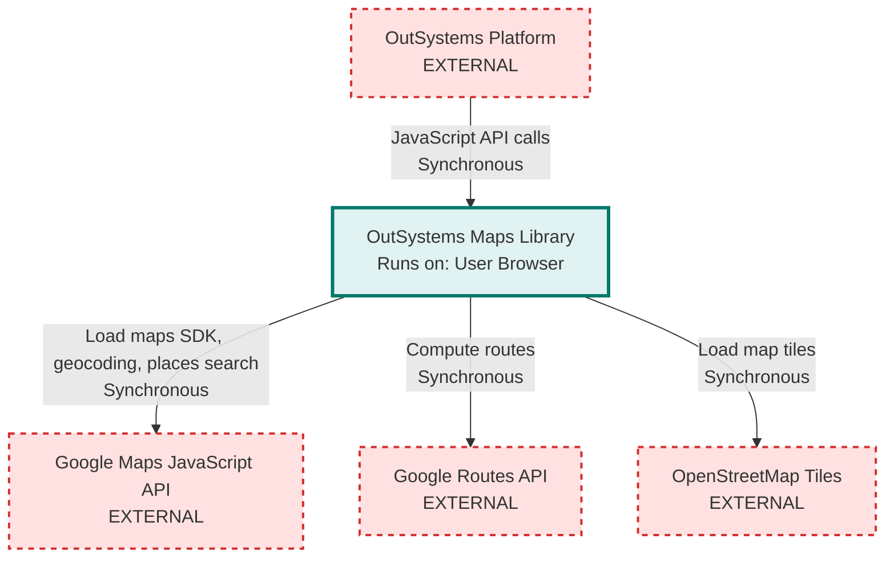

# OutSystems Maps Architecture

> **Repository:** outsystems-maps
> **Runtime Environment:** User Browser (JavaScript Library)
> **Last Updated:** 2026-03-03

## Overview

OutSystems Maps is a TypeScript library that provides a unified API for integrating interactive maps into OutSystems Reactive Web applications. It abstracts multiple map providers (Google Maps and Leaflet/OpenStreetMap) behind a common interface, allowing developers to build map-based features without JavaScript knowledge.

## Architecture Diagram

## External Integrations

| External Service | Communication Type | Purpose |
|------------------|-------------------|---------|
| Google Maps JavaScript API | Sync (HTTPS/JavaScript) | Render Google Maps, geocoding, places search, marker clustering, drawing tools |
| Google Routes API | Sync (HTTPS) | Calculate directions and route polylines via `routes.googleapis.com/directions/v2:computeRoutes` |
| OpenStreetMap Tiles | Sync (HTTPS) | Render Leaflet-based maps with OSM tile layers from `tile.openstreetmap.org` |
| OutSystems Platform | Sync (JavaScript API) | Host application that consumes this library via block parameters and events |

## Architectural Tenets

### T1. Provider Abstraction Must Isolate External Dependencies

The library maintains strict separation between provider-agnostic framework code and provider-specific implementations. All map provider logic (Google Maps, Leaflet) is contained within the `Provider.Maps` namespace, while the `OSFramework.Maps` namespace defines interfaces and abstract classes that do not reference concrete provider types. This allows adding new map providers without modifying core framework code.

**Evidence:**
- `src/OSFramework/Maps/OSMap/AbstractMap.ts` (in `AbstractMap` class) - defines common map behavior independent of provider using generic type parameter for provider object
- `src/Providers/Maps/Google/OSMap/OSMap.ts` (in `Map` class) - extends `AbstractMap` with Google-specific implementation for `google.maps.Map`
- `src/Providers/Maps/Leaflet/OSMap/OSMap.ts` (in `Map` class) - extends `AbstractMap` with Leaflet-specific implementation for `L.Map`
- `src/OSFramework/Maps/OSMap/Factory.ts` (in `MapFactory.MakeMap`) - routes provider selection to appropriate factory, the only place in framework layer that references provider namespaces

### T2. Public API Must Return Framework Interfaces, Not Provider Types

The OutSystems-facing API in `OutSystems.Maps.MapAPI` operates exclusively on framework interfaces from the `OSFramework.Maps` namespace. Public methods return interfaces like `IMap` and `IMarker`, never concrete provider classes. This ensures the external API remains stable regardless of which provider is selected at runtime or how provider implementations evolve.

**Evidence:**
- `src/OutSystems/Maps/MapAPI/MapManager.ts` (in `CreateMap`) - returns `OSFramework.Maps.OSMap.IMap` interface, not provider-specific class
- `src/OutSystems/Maps/MapAPI/MapManager.ts` (in `GetMapById`) - all lookup methods return framework interfaces
- `src/OutSystems/Maps/MapAPI/MarkerManager.ts` - marker operations work with framework marker interfaces
- `src/OSFramework/Maps/OSMap/IMap.ts` - interface exposes provider as generic `any` type, not concrete provider class

### T3. Framework Layer Owns Lifecycle and State Management

The `OSFramework` layer controls all component lifecycle (creation, initialization, disposal) and maintains parent-child relationships (maps contain markers, shapes, file layers). Provider implementations are passive adapters that respond to framework commands via the `build()` and `dispose()` methods defined by shared interfaces, but do not independently manage their lifecycle or relationships.

**Evidence:**
- `src/OSFramework/Maps/OSMap/AbstractMap.ts` (in `build`, `finishBuild`) - framework controls initialization sequence and triggers events
- `src/OSFramework/Maps/OSMap/AbstractMap.ts` (private fields `_markers`, `_shapes`, `_fileLayers`) - framework maintains collections of child components
- `src/OSFramework/Maps/Interfaces/IBuilder.ts` and `IDisposable.ts` - shared interfaces that enforce lifecycle contract
- `src/OSFramework/Maps/Marker/AbstractMarker.ts` (in `finishBuild`) - framework triggers initialization event and adds marker to clusterer after provider completes setup

### T4. Configuration Transformation Occurs at Provider Boundaries

User-facing configuration uses OutSystems-friendly structures (JSON strings, integer enums, string coordinates), while provider-specific configuration matches native API requirements (typed objects, native enums, coordinate objects). The `Configuration` namespace implements `getProviderConfig()` to transform between representations without exposing provider details to the framework layer.

**Evidence:**
- `src/OSFramework/Maps/Configuration/AbstractConfiguration.ts` (in `getProviderConfig`) - defines contract for transforming framework config to provider config
- `src/Providers/Maps/Google/Configuration/OSMap/GoogleMapConfig.ts` (in `getProviderConfig`) - transforms framework config to Google Maps API options, including mapId handling for advanced markers
- `src/Providers/Maps/Leaflet/Configuration/OSMap/LeafletMapConfiguration.ts` (in `getProviderConfig`) - transforms framework config to Leaflet API options
- `src/OutSystems/Maps/MapAPI/MapManager.ts` (in `CreateMap`) - accepts JSON config string from OutSystems, parses and passes to factory

### T5. Events Flow Through Framework Event Managers

All events (map clicks, marker interactions, provider-specific events) are normalized and dispatched through framework event managers that inherit from `AbstractEventsManager`. Provider implementations register native provider events but trigger framework events, which handle subscription management and callback execution consistently across providers. User callbacks never receive provider-specific event objects.

**Evidence:**
- `src/OSFramework/Maps/Event/AbstractEventsManager.ts` - provides centralized event subscription and dispatch mechanism used by all component types
- `src/OSFramework/Maps/Event/OSMap/MapEventsManager.ts` - manages all map-level events independent of provider, validates provider event types
- `src/Providers/Maps/Google/OSMap/OSMap.ts` (uses `google.maps.event.addListener`) - Google provider adds listeners via native API but triggers framework events
- `src/Providers/Maps/Leaflet/OSMap/OSMap.ts` (in `_setMapEvents`) - Leaflet provider converts native events to framework event format before triggering
